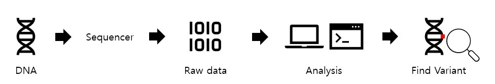
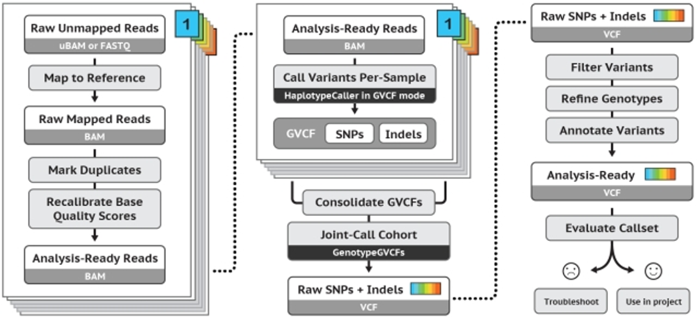
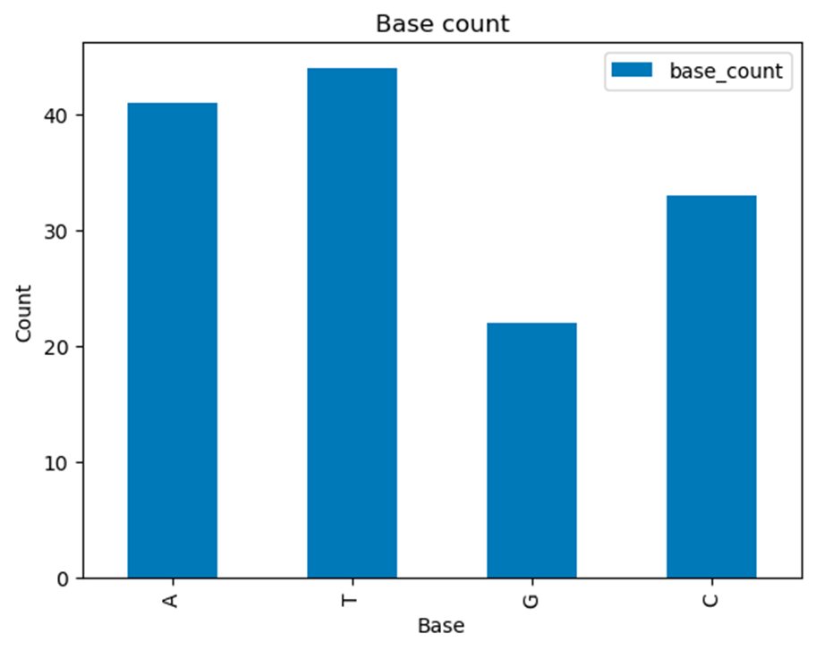
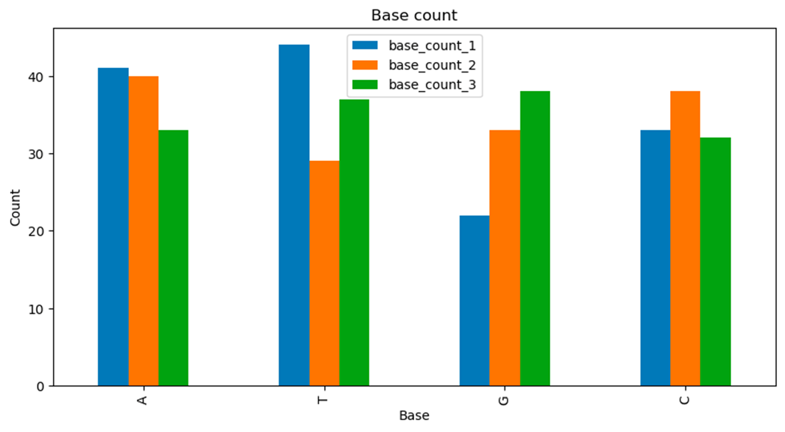
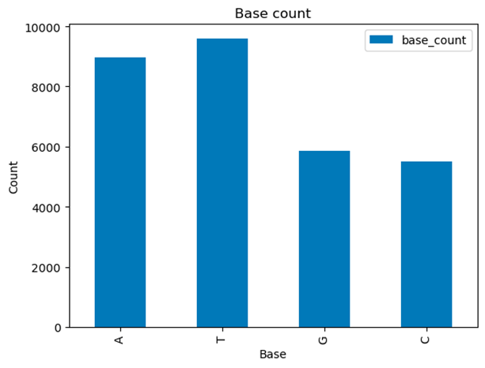

# DNA Germline Variant Analysis Pipeline


***
## Genome Reference Mapping (FASTQ mapping)
1. Download bwa [bwa github](https://github.com/lh3/bwa)
```shell
git clone https://github.com/lh3/bwa.git
cd bwa; make
./bwa  #bwa작동확인
sudo ln -s ~/etc/bwa/bwa/bwa  #링크걸기
which bwa  #링크확인

```
2. Download reference genome [ucsc genome browser](https://genome.ucsc.edu/)
```shell
wget [reference.fasta]
```
3. Make bwa index file
``` shell
bwa index [reference.fasta]
```
4. Download sample FASTQ file
5. align, sort, index
``` shell
bwa mem -t 1 -R "@RG\tID:sample\tSM:sample\tPL:platform" [reference.fasta 경로] [sample1.fastq] [sample2.fastq] > [.sam]  #Mapping to reference
samtools view -Sb [.sam] > [.mapped.bam]  ##SAM to BAM
samtools sort [.mapped.bam] -o [.sorted.bam]  ##BAM sorting
samtools index [.sorted.bam]  ##BAM indexing
```
***

## MarkDuplicates
1. Download picard tool
```shell
wget https://github.com/broadinstitute/picard/releases/download/3.1.1/picard.jar
```
- download java
```shell
sudo apt update
apt search openjdk-17-jdk
sudo apt install openjdk-17-jdk
```
- check java
```shell
which java
java -version
```
- check picard
```shell
java -jar picard.jar 
java -jar picard.jar MarkDuplicates 
```

2. MarkDuplicates
```shell
java -jar ~/etc/picard/picard.jar MarkDuplicates -I [.sorted.bam] -O [.markdup.bam] -M [.metrics.txt]
```
```shell
samtools view –f1024 [.markdup.bam] | wc -l  #dup된 read 개수
samtools view –F1024 [.markdup.bam] | wc -l  #dup되지 않은 read 개수
```
***

## Variant Calling
1. Download GATK 
```shell
wget https://github.com/broadinstitute/gatk/releases/download/4.5.0.0/gatk-4.5.0.0.zip
unzip gatk-4.5.0.0.zip
java -jar gatk-package-4.5.0.0-local.jar
```
- Prepare reference
```shell
gunzip [reference.fa.gz]
sudo apt install tabix
bgzip [reference.fasta]
samtools faidz [reference.fa.gz]
java -jar [picard.jar 경로] jar CreateSequenceDictionary -R [reference.fa.gz] 

```

2. HaplotypeCaller (BAM -> GVCF)
```shell
samtools index [.markdup.bam]
java -jar ~/etc/gatk/gatk-4.5.0.0/gatk-package-4.5.0.0-local.jar HaplotypeCaller -I [.markdup.bam] -O [.g.vcf.gz] -R [reference.fa.gz 경로] -ERC GVCF
```
```shell
zless -S [.g.vcf.gz]  ##gz파일 살펴보기
```

3. GenotypeGVCFs (GVCF -> VCF)
```shell
java -jar ~/etc/gatk/gatk-4.5.0.0/gatk-package-4.5.0.0-local.jar GenotypeGVCFs -V [.g.vcf.gz] -O [.vcf.gz] -R [reference.fa.gz 경로]
```
```shell
zless -S [.vcf.gz]
```
>결과파일 살펴보기  
>GT(genotype) = ref/alt  
>AD(allele depth) = ref,alt  
>DP(depth) = ref + alt  

> samtools tview [.markdup.bam]  
> white; high quality  
> colored; low quality
***

## Annotation
1. Download SnpEff
```shell
wget https://snpeff.blob.core.windows.net/versions/snpEff_latest_core.zip
unzip snpEff_latest_core.zip
```
- check SnpEff
```shell
java -jar snpEff.jar
```
2. Annotation
```shell
java -jar [snpEff.jar 경로] -v hg38 [.vcf.gz] > [.ann.vcf.gz]
```
```shell
zless -S [.ann.vcf.gz]
zgrep intron_variant [.ann.vcf.gz] | wc -l  
#인트론 영역에서 발생한 변이의 개수(최종단백질에영향X)
zgrep intergenic_region [.ann.vcf.gz] | wc -l  
#유전자와 유전자 사이 인터제닉 영역에서 발생한 변이의 개수(기능적영향X)
zgrep stop_gained [.ann.vcf.gz] | wc -l  
#단백질 합성을 조기 종료시키는 종결 코돈을 생성하는 변이의 개수(기능 상실 가능성 큼)
```
***

## VCF Parsing (Handle gzipped file)
1. count variant rows
```python
import gzip

rows = 0

with gzip.open("[.ann.vcf.gz]", "rt") as handle:
    for line in handle:
        if line.startswith("#"):
            continue

        rows += 1

    print(rows)
```
2. count variant rows with qual
```python
import gzip

rows = 0

with gzip.open("[.ann.vcf.gz]", "rt") as handle:
    for line in handle:
        if line.startswith("#"):
            continue

        rows = line.strip().split("\t")
        qual = float(row[5])
        if qual >= 1000 :
            result +=1

    print(result))
```

3. dynamic header index
```python
import gzip

rows = 0

with gzip.open("[.ann.vcf.gz]", "rt") as handle:
    for line in handle:
        if line.startswith("##"):
            continue

        elif line.startswith("#CHROM"):
            header = line.strip().split("\t")
            qual_idx = header.index("QUAL") #5
            continue

        row = line.strip().split("\t")
        qual = float(row[qual_idx])
        if qual >= 1000:
            result += 1

    print(result)

```

4. ts/tv (transition/transversion)
```python
import gzip

transition = 0
transversion = 0 

purtin = {"A", "G"}
pyramidine = {"C", "T"}

with gzip.open("[.ann.vcf.gz]", "rt") as handle:
    for line in handle:
        if line.startswith("##"):
            continue

        elif line.startswith("#CHROM"):
            header = line.strip().split("\t")
            ref_idx = header.index("REF")
            alt_idx = header.index("ALT")
            continue

        row = line.strip().split("\t")
        ref = row[ref_idx]
        alt = row[alt_idx]

        if ref in purine and alt in purine:
            transition += 1
        elif ref in pyrimidine and alt in pyrimidine:
            transition += 1
        elif ref in purine and alt in pyrimidine:
            transversion += 1
        elif ref in pyrimidine and alt in purine:
            transversion += 1

    print(round(transition / tranversion, 4))  #소수점 넷째자리까지
```

5. genotype의 개수
```python
import gzip

gt_data = dict()

with gzip.open("[.ann.vcf.gz]", "rt") as handle:
    for line in handle:
        if line.startswith("##"):
            continue

        elif line.startswith("#CHROM"):
            header = line.strip().split("\t")
            sample_idx = header.index("sample")
            continue
        row = line.strip().split("\t")
        gt = row[sample_idx].split(":")[0].replace("|", "/")
        if gt not in gt_data:
            gt_data[gt] = 0

        gt_data[gt] += 1

    print(gt_data)
```
***

## VCF Plotting
1. Pandas dataframe
```python
import pandas as pd

gt_data = {'1/1': 2133, '0/1': 6031, '1/2': 78}

gt_data = {"genotype": gt_data.keys(), "genotype_count": gt_data.values()}

df = pd.DataFrame(gt_data)
```
2. Pandas Dataframe to barplot
```python
import pandas as pd

gt_data = {'1/1': 2133, '0/1': 6031, '1/2': 78}

gt_data = {"genotype": gt_data.keys(), "genotype_count": gt_data.values()}

df = pd.DataFrame(gt_data)

df.plot(
    x = "genotype",
    y = ["genotype_count"],
    kind = "bar",
    title = "genotype count",
    ylabel = "counts",
)
```
***
  
***


# Biopython
```python
pip install biopython
import Bio
print(Bio.__version__) #설치확인
```
## FASTA
1. Biopython SeqIO_1 (read FASTA file)
```python
from Bio import SeqIO

fasta_file = "[FASTA]"
sequences = SeqIO.parse(fasta_file,"fasta")

for sequence in sequences:
    print(sequence.id)
    print(sequence.seq)
```

2. Base Counter
```python
from Bio import SeqIO

fasta_file = "[FASTA]"
sequences = SeqIO.parse(fasta_file,"fasta")

data = dict()

for sequence in sequences:
    for base in sequence.seq:
        if base not in data:
            data[base] = 0
        data[base] += 1

print(data)
```

3. Base Counter Bar Plot
```python
from Bio import SeqIO

fasta_file = "[FASTA]"
sequences = SeqIO.parse(fasta_file,"fasta")

data = dict()

for sequence in sequences:
    for base in sequence.seq:
        if base not in data:
            data[base] = 0
        data[base] += 1

import pandas as pd
df_data = {"base": data.keys(), "base_count": data.values()}
df = pd.DataFrame(df_data)
df.plot(
    kind = "bar",
    x = "base",
    y = "base_count",
    title = "Base count",
    xlabel = "Base",
    ylabel = "Count",
)
```


```python
from Bio import SeqIO

fasta_file = "[FASTA]"
sequences = SeqIO.parse(fasta_file,"fasta")

data = list()

for sequence in sequences:
    data = dict()
    for base in sequence.seq:
        if base not in data:
            data[base] = 0
        data[base] += 1
    data_base.append[data]

import pandas as pd
df_data = {"base": data_base[0].keys()}

for i, data in ecumerate{data_base}:
    df_data[f"base_count_{i+1}"] = data.values()

print(df_data)

df = pd.DataFrame(df_data)
df.plot(
    kind = "bar",
    x = "base",
    y = "base_count",
    title = "Base count",
    xlabel = "Base",
    ylabel = "Count",
    figsize=[10,5],
)
```



## GenBank
1. Download GenBank file [link](https://www.ncbi.nlm.nih.gov/genbank/)

2. GenBank file Parsing
```python
from Bio import SeqIO

fasta_file = "[GenBank file]"
sequences = SeqIO.parse(fasta_file, "genbank")

data = dict()

for sequence in sequences:
    for base in sequence.seq:
        if base not in data:
            data[base] = 0
        data[base] += 1

print(data)
```

3. Base Count Plot
```python
from Bio import SeqIO

fasta_file = "[GenBamk file]"
sequences = SeqIO.parse(fasta_file, "genbank")

data = dict()

for sequence in sequences:
    for base in sequence.seq:
        if base not in data:
            data[base] = 0
        data[base] += 1

import pandas as pd
df_data = {"base": data.keys(), "base_count": data.values()}
print(df_data)
df = pd.DataFrame(df_data)
df.plot(
    kind = "bar"
    x = "base"
    y = "base_count"
    title = "base count"
    xlabel = "Base"
    ylabel = "count"
)
```

***

## Entrez
1. Download GenBank file
```python
from Bio import Entrez

Entrez.email = "[email]"
handle = Entrez.efetch(db = "nucleotide", rettype = "gb", id = "[ID]", retmode = "text")
write_filepath = "[filename.gb]"
with open(write_filepath, "w") as fw:
    for line in handle:
        fw.write(line)
```
```python
from Bio import SeqIO

record = SeqIO.read("[write_filepath]", "genbank")
print(record)
```

2. Download several GenBank files (automation programming)
```python
from Bio import Entrez

def make_ncbi_id_list(ncbi_filepath: str) -> list:
    ncbi_ids = list()
    with open(ncbi_filepath) as handle:
        for line in handle:
            ncbi_ids.append(line.strip())
    
    return ncbi_ids

def genbank_downloader(ncbi_id: str) -> None:
    Entrez.email = "[email]"
    handle = Entrez.efetch(db = "nucleotide", rettype = "gb", id = ncbi_id, retmode = "text")
    write_filepath = f"{ncbi_id}.gb"
    with open(write_filepath, "w") as fw:
        for line in handle:
            fw.write(line)
    print(f"# DONE: {write_filepath}")

def main(ncbi_filepath):
    ncbi_ids = make_ncbi_id_list(ncbi_filepath)
    for ncbi_id in ncbi_ids:
        genbank_downloader(ncbi_id)

if __name__ = "__main__":
    main("ncbi_id_list.txt")
```
```python
# 여러 genbank파일 각각에서 해당하는 아래 정보를 parsing하여 출력하는 프로그램
# id, sequence length, description, molecule_type, organism


from Bio import Entrez

def make_ncbi_id_list(ncbi_filepath: str) -> list:
    ncbi_ids = list()
    with open(ncbi_filepath) as handle:
        for line in handle:
            ncbi_ids.append(line.strip())
    
    return ncbi_ids

def read_genbank_file(genbank_filepath: str) -> None:
    record = SeqIO.read(genbank_filepath, "genbank")
    print(record.id)
    print(len(record.seq))
    print(record.description)
    print(record.annotations["molecule_type"])
    print(record.annotations["organism"])
    print("")

def main(ncbi_filepath):
    ncbi_ids = make_ncbi_id_list(ncbi_filepath)
    for ncbi_id in ncbi_ids:
        read_genbank_file(f"{ncbi_id}.gb")

if __name__ = "__main__":
    main("ncbi_id_list.txt")
```
***

***

# TDD (Test Driven Development)
## pytest
## parameterize
## mocking

